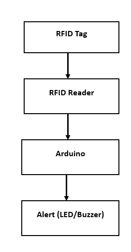

# RFID-Based Goal Line Technology (Arduino)

> Embedded Systems Project | Arduino | RFID | Real-Time Detection

---

## 🏗️ System Architecture

---

## 📌 Overview
Designed and implemented an Arduino-based RFID system for real-time goal-line detection in football, eliminating reliance on traditional camera-based analysis. The system detects when a tagged ball crosses the goal line and triggers an instant alert.

---

## ⚙️ System Architecture & Workflow
1. RFID tag embedded in the football  
2. RFID reader positioned at the goal line  
3. Arduino receives RFID signal  
4. System processes signal to detect crossing event  
5. Instant alert triggered (LED/Buzzer)  

---

## 🧠 Key Features
- Real-time goal detection using RFID  
- Low-latency signal processing  
- Instant alert generation  
- Reduced dependency on camera-based systems  

---

## 🔧 Hardware Components
- Arduino (Uno/Nano)  
- RFID Reader Module (RC522 or similar)  
- RFID Tags  
- Buzzer / LED  
- Power Supply  

---

## 🔄 Detection Logic

- RFID signal detected → validate tag ID  
- Check proximity / signal strength  
- If goal-line threshold crossed → trigger event  
- Activate alert (buzzer/LED)  

---

## 🧠 Firmware Logic (Pseudo Code)

loop:
if RFID tag detected:
read tag ID
if valid tag:
check position
if goal line crossed:
trigger alert

---

## 🧪 Testing & Validation
- Tested RFID detection accuracy at different distances  
- Verified real-time response using repeated trials  
- Debugged signal inconsistencies during hardware testing  

---

## ⚠️ Challenges & Solutions
- Signal interference → adjusted reader positioning  
- Detection delay → optimized firmware logic  
- False positives → added validation checks  

---

## 📈 Key Learnings
- RFID communication and signal processing  
- Real-time embedded system design  
- Hardware-software integration  
- Debugging sensor-based systems  

---

## 📎 Note
This repository focuses on system design and implementation approach. Source code is not included.
